# Player Onboarding Workflow

This document defines the player onboarding process from initial connection through to gameplay.

## Current State vs. Proposed Workflow

### Current Implementation (Minimal)
Currently, the system only:
1. Prompts for username
2. Creates a new Player object if username doesn't exist
3. Immediately enters gameplay

**Issues:**
- No password/authentication
- No character customization
- New players start with default stats
- No tutorial or introduction

### Proposed New Player Onboarding Workflow

```mermaid
flowchart TD
    Start([Client Connects to Telnet Server]) --> AcceptConnection[Accept TCP Client Connection]
    AcceptConnection --> CreateNetwork[Create PlayerNetwork Object]
    CreateNetwork --> PromptUsername[Display 'Username:' Prompt]
    
    PromptUsername --> ReadUsername[Read Username Input]
    ReadUsername --> ValidateUsername{Username<br/>Valid?}
    
    ValidateUsername -->|Empty/Null| PromptUsername
    ValidateUsername -->|Valid| CheckExisting{Player<br/>Exists?}
    
    CheckExisting -->|Yes - Existing Player| PromptPassword[Prompt for Password]
    PromptPassword --> ValidatePassword{Password<br/>Correct?}
    ValidatePassword -->|No| InvalidPassword[Show Error Message]
    InvalidPassword --> PasswordAttempts{Attempts<br/>< 3?}
    PasswordAttempts -->|Yes| PromptPassword
    PasswordAttempts -->|No| DisconnectFailed[Disconnect - Too Many Attempts]
    DisconnectFailed --> End
    ValidatePassword -->|Yes| LoadPlayer[Load Player from GameState.Players]
    
    CheckExisting -->|No - New Player| ConfirmNew{Confirm New<br/>Character?}
    ConfirmNew -->|No| PromptUsername
    ConfirmNew -->|Yes| PromptNewPassword[Prompt for New Password]
    PromptNewPassword --> ConfirmPassword[Confirm Password Entry]
    ConfirmPassword --> PasswordMatch{Passwords<br/>Match?}
    PasswordMatch -->|No| PromptNewPassword
    PasswordMatch -->|Yes| CreatePlayer[Create New Player Object]
    
    CreatePlayer --> DisplayIntro[Display Character Creation Intro]
    DisplayIntro --> SelectClass[Select Character Class]
    
    SelectClass --> ShowClassOptions[Show Available Classes<br/>Fighter, Mage, Rogue, Cleric]
    ShowClassOptions --> ReadClassChoice[Read Class Selection]
    ReadClassChoice --> ValidateClass{Valid<br/>Class?}
    ValidateClass -->|No| ShowClassOptions
    ValidateClass -->|Yes| AssignClass[Assign Class to Player]
    
    AssignClass --> RollStats[Roll Ability Scores]
    RollStats --> DisplayStats[Display: STR, DEX, CON, INT, WIS, CHA]
    DisplayStats --> AcceptStats{Accept<br/>Stats?}
    AcceptStats -->|No - Reroll| RollStats
    AcceptStats -->|Yes| AssignStats[Assign Stats to Player]
    
    AssignStats --> SetDerivedStats[Calculate MaxHealth from CON<br/>Set Health = MaxHealth]
    SetDerivedStats --> AssignStartGear[Assign Class Starting Equipment]
    AssignStartGear --> SetInitialLocation[Set Location to StartAreaId/StartRoomId]
    SetInitialLocation --> AddToGameState[Add Player to GameState.Players]
    
    LoadPlayer --> AttachNetwork[Attach PlayerNetwork to Player]
    AddToGameState --> AttachNetwork
    
    AttachNetwork --> LoginProcess[Execute player.Login Method]
    
    LoginProcess --> SetOnline[Set IsOnline = true]
    SetOnline --> RecordLogin[Record LastLogin = DateTime.Now]
    RecordLogin --> CreateConsole[Create AnsiConsole for Player]
    
    CreateConsole --> CheckFirstTime{First<br/>Login?}
    CheckFirstTime -->|Yes| DisplayTutorial[Display Tutorial/Introduction]
    DisplayTutorial --> DisplayMOTD
    CheckFirstTime -->|No| DisplayMOTD[Display Message of the Day]
    
    DisplayMOTD --> DisplayWelcome[Display Welcome Panel]
    DisplayWelcome --> DisplayCharSheet[Display Character Sheet Summary]
    DisplayCharSheet --> RenderMap[Render Local Map]
    
    RenderMap --> LogConnection[Log 'New client connected']
    LogConnection --> CommandLoop[Enter Command Processing Loop]
    
    CommandLoop --> WaitCommand{Wait for<br/>Command}
    
    WaitCommand -->|Command Received| ParseCommand[CommandManager.ParseCommand]
    ParseCommand --> ExecuteCommand[CommandManager.Execute]
    
    ExecuteCommand --> CheckMatch{Command<br/>Matched?}
    
    CheckMatch -->|Yes| RunCommand[Execute Command Logic]
    CheckMatch -->|No| ShowError[Display 'I don't know what you mean']
    
    RunCommand --> CommandLoop
    ShowError --> CommandLoop
    
    WaitCommand -->|Connection Lost| Disconnect[Client Disconnected]
    WaitCommand -->|Logout/Quit Command| SaveAndLogout[Execute player.Logout]
    
    SaveAndLogout --> UpdatePlaytime[Update PlayTime]
    UpdatePlaytime --> SavePlayer[Save Player Data]
    SavePlayer --> SetOffline[Set IsOnline = false]
    SetOffline --> Disconnect
    
    Disconnect --> LogDisconnect[Log 'Client disconnected']
    LogDisconnect --> End([Connection Closed])
    
    style Start fill:#90EE90
    style End fill:#FFB6C1
    style DisconnectFailed fill:#FF6B6B
    style CreatePlayer fill:#87CEEB
    style LoadPlayer fill:#87CEEB
    style LoginProcess fill:#FFD700
    style CommandLoop fill:#DDA0DD
    style Disconnect fill:#FFA07A
    style SelectClass fill:#98D8C8
    style RollStats fill:#98D8C8
    style PromptPassword fill:#F7DC6F
    style PromptNewPassword fill:#F7DC6F
```



## Detailed Workflow Stages

### 1. Connection Stage
- Client connects to Telnet server on port 5555
- Server accepts TCP client connection
- PlayerNetwork object created with Reader/Writer streams

### 2. Authentication Stage

#### Existing Players:
- Username prompt displayed
- Password prompt (with retry limit of 3 attempts)
- Password validation using hashed comparison
- Disconnect after failed attempts

#### New Players:
- Username prompt with validation
- Confirmation prompt: "That character doesn't exist. Create it? (Y/N)"
- Password creation (with confirmation)
- Password match validation

### 3. Character Creation Stage (New Players Only)

#### Class Selection:
- Display available classes with descriptions:
  - **Fighter**: High STR/CON, melee combat specialist
  - **Mage**: High INT, spell casting, low HP
  - **Rogue**: High DEX, stealth and precision
  - **Cleric**: High WIS, healing and support
- Validate selection
- Assign class to player

#### Ability Score Assignment:
- Roll random stats (or use point-buy system)
- Display scores: STR, DEX, CON, INT, WIS, CHA
- Allow reroll option (limited times?)
- Confirm and assign

#### Initial Setup:
- Calculate derived stats:
  - MaxHealth = 10 + (CON modifier)
  - Health = MaxHealth
- Assign starting equipment based on class
- Set initial location (StartAreaId/StartRoomId)
- Add to GameState.Players collection

### 4. Login Process
- Attach PlayerNetwork to Player object
- Execute Login() method:
  - Set IsOnline = true
  - Record LastLogin timestamp
  - Create individual AnsiConsole instance

### 5. Welcome Stage

#### First-Time Login:
- Display tutorial/introduction text
- Explain basic commands
- Explain game mechanics

#### All Logins:
- Display MOTD (Message of the Day)
- Show welcome panel using RPGPanel
- Display character sheet summary
- Render local map using MapRenderer

### 6. Gameplay Loop
- Enter command processing loop
- Parse incoming commands using CommandManager
- Execute matched commands (navigation, combat, social, etc.)
- Continue until disconnect or logout

### 7. Disconnect/Logout Stage
- Triggered by connection loss or quit/logout command
- Update PlayTime duration
- Save player data to persistence
- Set IsOnline = false
- Close network connection

## Data Validation Rules

| Field | Validation Rules |
|-------|-----------------|
| Username | 3-20 characters, alphanumeric + underscore, case-insensitive uniqueness |
| Password | Minimum 8 characters, stored as hashed value |
| Class Selection | Must match available class list |
| Ability Scores | Range 3-18 (or 8-15 for point-buy) |
| Stats Reroll | Maximum 3 rerolls per character creation |

## User Input Points

| Stage | Input Required | Validation |
|-------|---------------|------------|
| Username Entry | String | Not empty, not duplicate |
| Password Entry | String (masked) | Not empty |
| New Character Confirmation | Y/N | Yes or No |
| Password Creation | String (masked) | Min length, match confirmation |
| Class Selection | Number or Name | Valid class option |
| Accept Stats | Y/N | Yes or No |

## Security Considerations

1. **Password Storage**: Use bcrypt or similar hashing algorithm
2. **Failed Login Attempts**: Limit to 3 attempts, then disconnect
3. **Session Management**: Track IsOnline to prevent duplicate logins
4. **Input Sanitization**: Validate all user inputs before processing

## Implementation Requirements

### New Classes/Components Needed:
1. `PasswordManager` - Hash and validate passwords
2. `CharacterCreationWizard` - Guide new player through creation
3. `ClassDefinitions` - Define available classes and starting gear
4. `StatRoller` - Generate ability scores
5. `Tutorial` - First-time player guidance

### Modified Components:
1. `TelnetServer.HandleClientAsync()` - Add authentication and creation flow
2. `Player` class - Add Password property (hashed)
3. `GameState` - Add methods to check username availability

### New Player Properties:
```csharp
public string PasswordHash { get; set; }
public bool IsFirstLogin { get; set; } = true;
public DateTime CreatedDate { get; set; }
public int LoginCount { get; set; } = 0;
```

## Future Enhancements

- Email verification for account recovery
- Multi-factor authentication option
- Race selection in addition to class
- Character appearance customization
- Background/backstory selection
- Starting location choice based on race/class
- Mentorship program (pair new players with veterans)
- Achievement for completing tutorial

## Next Steps

1. Review and approve this workflow design
2. Create sequence diagrams for complex interactions
3. Define class definitions and starting equipment
4. Implement password hashing system
5. Build CharacterCreationWizard component
6. Update TelnetServer with new onboarding flow
7. Create tutorial content
8. Test with new player scenarios
9. Update documentation
